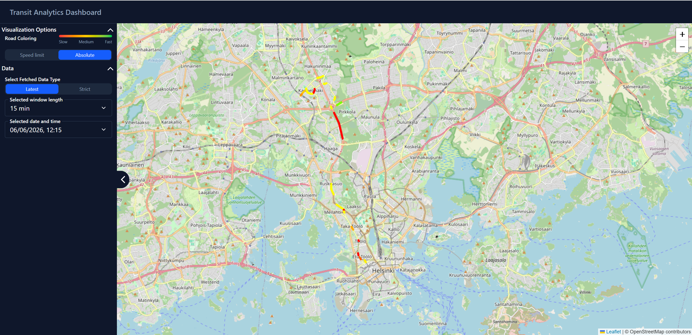

# Transit Stream Analytics

The system collects public transport data from Digitransit and processes it as a streaming data pipeline.

## Description

The transit data is from Digitransit and the documentation of the live vehicle positioning API can be found [here](https://digitransit.fi/en/developers/apis/5-realtime-api/vehicle-positions/high-frequency-positioning/). In the app, the following values are used:
- `dir`: route direction of the trip: "1" or "2"
- `spd`: Speed of vehicle in m/s
- `tst`: Timestamp
- `veh`: Vehicle number
- `lat`: The latitude of the vehicle
- `long`: The longitude of the vehicle
- `dl`: The timetable offset of the vehicle in seconds. Negative if vehicle is behind schedule
- `drst`: 1 if any of the doors is open, otherwise 0
- `desi`: Route number visible to passengers
- `route`: ID of the route the vehicle is currently running on

First, the system receives and validates the Digitransit data. The data fetched from Digitransit can be changed by modifying the parameters in the `MQTT_BROKER_TOPIC` environmental variable found in the `.env` file as stated [here](https://digitransit.fi/en/developers/apis/5-realtime-api/vehicle-positions/high-frequency-positioning/#message-format). The validated data is then sent to Kafka. A PySpark job reads the data from Kafka and stores the raw data in PostgreSQL.

The Spark job also processes the data further. It groups the data into 15-minute time windows and calculates the average speed of transit vehicles during each window. This makes it possible to see how fast public transport has travelled on a specific road over time. The aggregated data is also stored in PostgreSQL.

A Python backend provides an API for querying data stored in PostgreSQL. The frontend uses this API to visualize the data on a map, allowing users to view the latest traffic information or select a specific time period to explore historical data. The color of each road represents the traffic speed, with green indicating faster traffic and red indicating slower traffic. Users can also compare traffic speeds either with the corresponding speed limit or with an absolute reference value of 100. An example of the frontend is shown in the image below.



## Technologies

### Backend

- Python and FastAPI - provides the backend API
- PySpark - processes and aggregates the streaming data
- PostgreSQL - stores raw and aggregated data
- Kafka - handles the streaming data
- Prometheus - monitors the transit consumer

### Frontend

- React, Vite and TypeScript - used to build the frontend
- TailwindCSS - used for styling
- Leaflet and OpenStreetMap - used to display the map and transit data

## Setup

The application has been tested with the following versions:

* Docker `v29.4.0`
* Docker Compose `v5.1.2`
* npm `v11.4.1`

### 1. Start the containers

Start the required Docker containers:

```bash
docker compose up -d
```

### 2. Set up the backend

Navigate to the backend directory and sync the Python dependencies:

```bash
uv sync
```

Provision Kafka:

```bash
uv run python -m src.provision_kafka
```

Insert the required geographic data into PostgreSQL:

```bash
uv run python -m src.geo_data_ingestor
```

### 3. Start the API

From the backend directory, start the FastAPI application:

```bash
uv run python -m src.main
```

### 4. Start the transit consumer

Start the transit data consumer:

```bash
uv run python -m src.transit_consumer
```

The consumer receives data from Digitransit and sends it to Kafka.

### 5. Start the Spark job

Run the Spark streaming job inside the Spark container:

```bash
docker exec -it spark /opt/spark/bin/spark-submit /spark_stream_app/src/main.py
```

The Spark job reads data from Kafka, stores the raw data in PostgreSQL, and creates the 15-minute speed averages.

### 6. Start the frontend

Navigate to the frontend directory and install the dependencies:

```bash
npm install
```

Start the development server:

```bash
npm run dev
```

The application should now be available through the frontend development server: <http://localhost:5173/>
